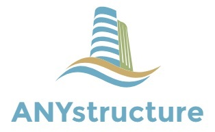

Welcome to ANYstructure's documentation!
========================================
This documentation focuses on the Python API and the current public
functionality exposed by the ``anystruct`` package.

For GUI documentation, see the following link:

`ANYstructure GUI documentation <https://sites.google.com/view/anystructure/start>`_

Python
------
To install ANYstructure use PIP:

.. code:: shell

   pip install anystructure

API basic usage:

.. code:: python

   from anystruct import api
   flat = api.FlatStru("Flat plate, stiffened")
   cylinder = api.CylStru("Orthogonally Stiffened shell")

See :doc:`api_examples` for complete flat plate, cylinder, buckling method,
and project file examples. See :doc:`api_manual_report` for a compact
manual/report version.

The GUI can be started by:

.. code:: shell

   from anystruct import gui
   gui.main()

An entry point to the GUI is also installed with PIP:

ANYstructure.exe in your python installation (Scripts).

Windows executable
------------------
The latest release of ANYstructure can be downloaded here:

`Github releases <https://github.com/audunarn/ANYstructure/releases>`_

Install and launch the app.

.. toctree::
    :hidden:

   install
   support
   api_examples
   api_manual_report
   api
   modules
